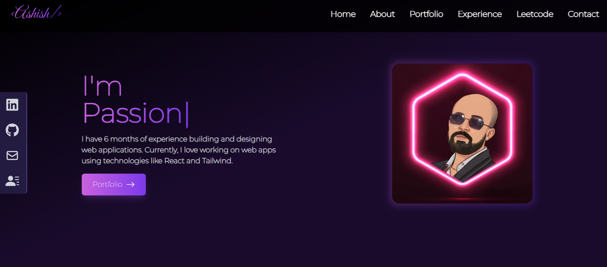

# Modern React Portfolio

A sleek, modern portfolio website built with React, Tailwind CSS, and Framer Motion, featuring dynamic animations, dark theme, and interactive components.



## ✨ Features

- **Modern UI/UX**: Clean and professional design with gradient accents
- **Dark Theme**: Aesthetic dark theme with purple gradient highlights
- **Interactive Components**:
  - Dynamic typing animations
  - Animated counters with IntersectionObserver
  - Education timeline with vertical progression
  - Infinite testimonial slider
  - LeetCode statistics integration
  - Contact form with validation
  - Smooth scroll navigation
  - Portfolio project showcase
  - Social media links

## 🛠️ Built With

- **React.js** - Frontend framework
- **Tailwind CSS** - Styling and responsive design
- **Framer Motion** - Smooth animations
- **React Vertical Timeline** - Education timeline
- **React CountUp** - Animated statistics
- **React Typed** - Typing animations
- **React Toastify** - Toast notifications
- **React Icons** - Icon components

## 🚀 Getting Started

1. **Clone the repository**
   ```powershell
   git clone <your-repo-url>
   cd react-portfolio
   ```

2. **Install dependencies**
   ```powershell
   npm install
   ```

3. **Start development server**
   ```powershell
   npm start
   ```

## 📁 Project Structure

```
react-portfolio/
├── src/
│   ├── components/          # React components
│   │   ├── About.js        # About section with timeline
│   │   ├── Contact.js      # Contact form
│   │   ├── Experience.js   # Experience section
│   │   ├── Home.js         # Hero section
│   │   ├── LeetCodeStats.js # LeetCode integration
│   │   └── ...
│   ├── assets/            # Images and static files
│   └── index.js          # App entry point
└── public/              # Public assets
```

## 📱 Responsive Design

- Mobile-first approach
- Responsive breakpoints:
  - Mobile: < 640px
  - Tablet: 768px
  - Desktop: 1024px+
- Fluid typography and spacing

## 🎨 Features Breakdown

### Home Section
- Hero section with dynamic typing effect
- Profile image with gradient border
- Call-to-action buttons

### About Section
- Animated statistics counters
- Educational timeline
- Client testimonials with infinite scroll
- Skills showcase

### Portfolio Section
- Project showcase with hover effects
- Project filtering capability
- Links to live demos and source code

### Contact Section
- Form validation
- Toast notifications
- Social media links
- GetForm.io integration

## 🔧 Configuration

The project uses the following main dependencies:
- React 18+
- Tailwind CSS 3
- Framer Motion 6+
- React Router 6

## 🌟 Key Features Deep Dive

### Education Timeline
- Vertical timeline showing educational journey
- Custom icons for different education levels
- Smooth animations on scroll
- Gradient accents and hover effects

### Testimonials
- Infinite scroll carousel
- Client testimonials with ratings
- Profile pictures and role information
- Smooth animations and transitions

### Contact Form
- Real-time form validation
- Integration with GetForm.io
- Toast notifications for success/error
- Responsive design across devices

## 📈 Performance Optimization

- Lazy loading of images
- Code splitting for optimal load times
- Optimized animations
- Efficient state management

## 🛡️ Best Practices

- Component-based architecture
- Clean and maintainable code
- Proper error handling
- Responsive design patterns
- SEO-friendly structure

## 🔍 Future Enhancements

- Blog section integration
- Dark/Light theme toggle
- Multi-language support
- Project filtering by technology
- Enhanced animations

## 📝 License

This project is licensed under the MIT License - see the [LICENSE](LICENSE) file for details.

## 🤝 Contact

Ashish - https://www.linkedin.com/in/ashish-kumar-4b3396213/ - ashish397868@gmail.com

Project Link: https://admirable-yeot-633041.netlify.app/

## 🙏 Acknowledgments

- [React.js](https://reactjs.org/)
- [Tailwind CSS](https://tailwindcss.com/)
- [Framer Motion](https://www.framer.com/motion/)
- [React Icons](https://react-icons.github.io/react-icons/)

---

⭐ Don't forget to star this repository if you found it helpful!
